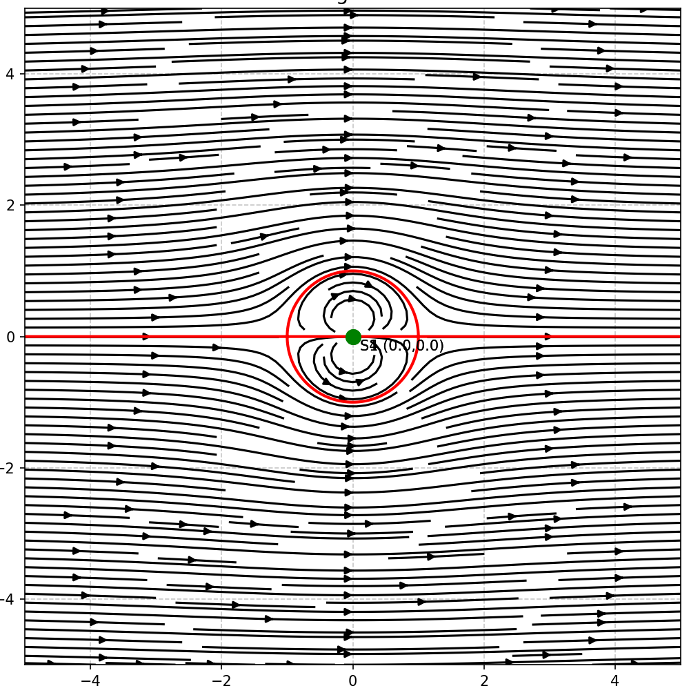
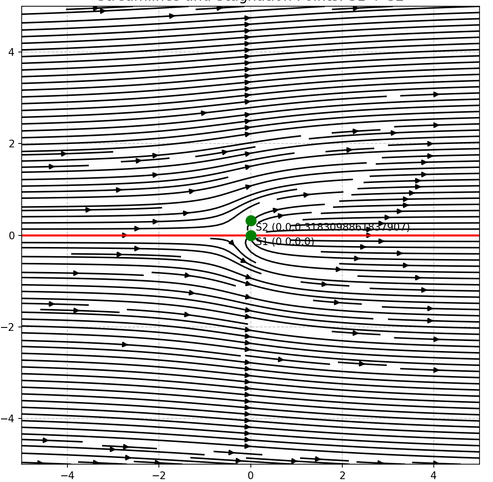
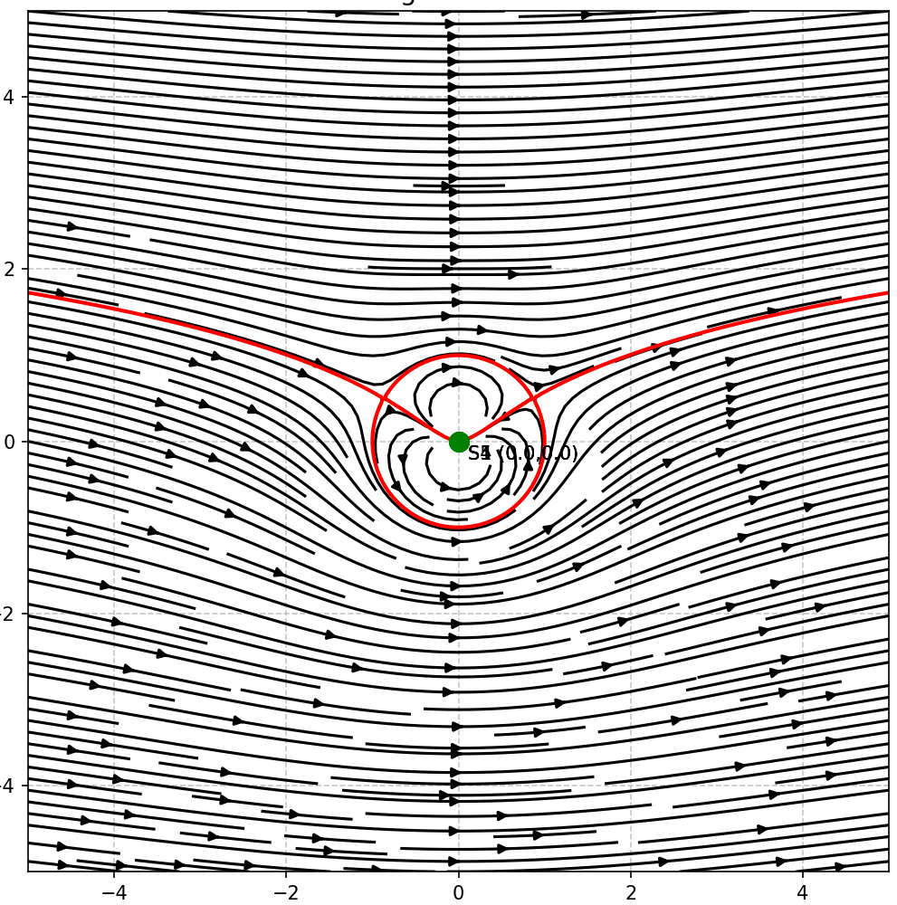

# Potential Flow Analyzer

A 2D potential flow visualization tool built in Python that models and visualizes complex fluid flow fields by superimposing classical flow elements. The program computes stream functions symbolically using SymPy, evaluates them numerically across a 2D grid, and produces publication-quality streamline plots with stagnation point detection and body surface identification.

---

## Table of Contents
- [Overview](#overview)
- [Flow Elements](#flow-elements)
- [Theory](#theory)
- [Dependencies](#dependencies)
- [Installation](#installation)
- [Usage](#usage)
- [Examples](#examples)
- [Output](#output)
- [Author](#author)

---

## Overview

Potential flow theory models inviscid, irrotational fluid flow using a scalar stream function ψ. By superimposing multiple elementary flow solutions, complex geometries and flow patterns can be approximated analytically. This tool automates that process — the user selects which flow elements to combine, enters their parameters, and the program handles all symbolic math, numerical evaluation, and visualization.

**Key capabilities:**
- Symbolic stream function construction via SymPy
- Analytical velocity field derivation (exact derivatives, no numerical approximation)
- Automatic body surface detection from the ψ = 0 contour
- Stagnation point identification across the full flow field
- Rankine half-body closed-form analysis (when S1 + S2 are selected)
- Streamline masking to prevent plotting inside solid bodies

---

## Flow Elements

| Code | Element | Description |
|------|---------|-------------|
| `S1` | Uniform Flow | Constant horizontal velocity field. Almost always used as the base layer. |
| `S2` | Source | Fluid radiating outward equally in all directions from a point. |
| `S3` | Sink | Fluid converging into a point from all directions. Opposite of a source. |
| `S4` | Doublet | Limiting case of a source-sink pair. Combined with S1 produces flow over a cylinder. |
| `S5` | Vortex | Fluid rotating around a central point. Combined with S1 + S4 produces a lifting cylinder (Kutta-Joukowski). |

---

## Theory

The stream function ψ for each element is defined in polar coordinates centered on the element's origin:

| Element | Stream Function |
|---------|----------------|
| Uniform Flow | ψ = U · r · sin(θ) |
| Source | ψ = (Q · θ) / 2π |
| Sink | ψ = -(Q · θ) / 2π |
| Doublet | ψ = -(k · sin(θ)) / (2π · r) |
| Vortex | ψ = -2R²w · log(r/R) |

Velocity components are derived analytically from the stream function:
- **u** = ∂ψ/∂y (x-direction velocity)
- **v** = -∂ψ/∂x (y-direction velocity)

Superposition of stream functions is valid because the governing Laplace equation (∇²ψ = 0) is linear.

---

## Dependencies

```
numpy
matplotlib
sympy
```

---

## Installation

1. **Clone the repository**
```bash
git clone https://github.com/aaditrip1/potential-flow-analyzer.git
cd potential-flow-analyzer
```

2. **Install dependencies**
```bash
pip install numpy matplotlib sympy
```

3. **Run the program**
```bash
python potentialflow1.py
```

---

## Usage

The program runs interactively in the terminal. Here is a step-by-step walkthrough:

**Step 1 — Enter how many flow elements you want to combine**
```
Enter the number of S functions to sum: 2
```

**Step 2 — For each element, enter its type**
```
Enter S1 (S1, S2, S3, S4, or S5): S1
```

**Step 3 — Enter the origin coordinates for that element**
```
Enter x-coordinate of origin for S1: 0
Enter y-coordinate of origin for S1: 0
```

**Step 4 — Enter the element-specific parameters**

Each element asks for different parameters:

| Element | Parameters Prompted |
|---------|-------------------|
| S1 — Uniform Flow | `U` — flow velocity |
| S2 — Source | `Q` — source strength |
| S3 — Sink | `Q` — sink strength |
| S4 — Doublet | `k` — doublet strength |
| S5 — Vortex | `R` — reference radius, `w` — angular rotation speed |

**Step 5 — View the output**

The program prints the symbolic stream function to the terminal, then displays the streamline plot.

---

## Examples

### Flow Over a Cylinder — S1 + S4
Superimpose Uniform Flow + Doublet centered at the origin:
```
Number of functions: 2
S1 → origin (0, 0) → U = 1
S4 → origin (0, 0) → k = 6.283
```


---

### Rankine Half-Body — S1 + S2
Superimpose Uniform Flow + Source:
```
Number of functions: 2
S1 → origin (0, 0) → U = 1
S2 → origin (0, 0) → Q = 2
```
> When S1 + S2 are selected, the program automatically prints the stagnation point location and body outline equation.



---

### Lifting Cylinder (Kutta-Joukowski) — S1 + S4 + S5
Superimpose Uniform Flow + Doublet + Vortex:
```
Number of functions: 3
S1 → origin (0, 0) → U = 1
S4 → origin (0, 0) → k = 6.283
S5 → origin (0, 0) → R = 1, w = 0.5
```
> This configuration demonstrates the Kutta-Joukowski theorem — the fundamental principle behind lift generation on airfoils.



---

## Output

The final plot displays:
- **Black streamlines** — flow trajectories across the field
- **Red contour** — detected body surface (ψ = 0)
- **Blue dots** — stagnation points where velocity = 0
- **Green dots** — origin of each flow element

---

## Author

**Aadi Tripathi**  
Date: March 2025
